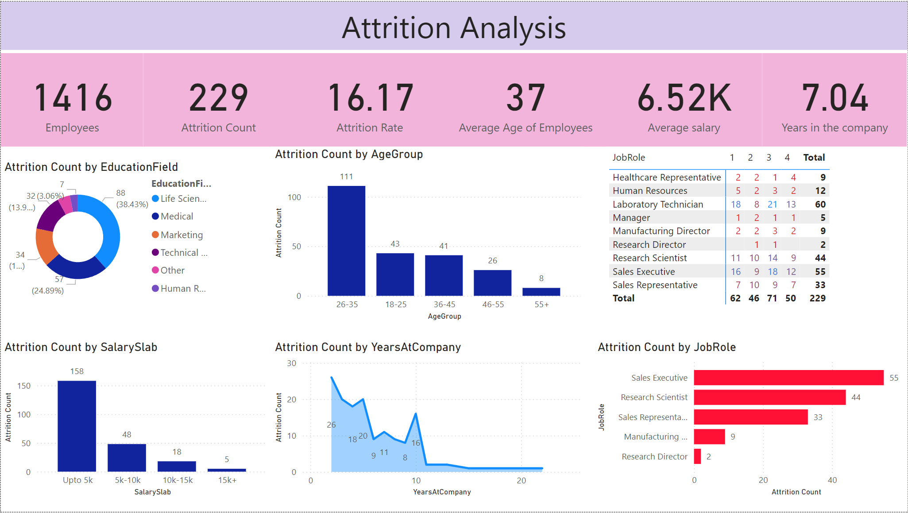

# 🔄 HR Attrition Analysis Dashboard

[](https://opensource.org/licenses/MIT)
[](https://powerbi.microsoft.com/)
[](Dataset/HR_Analytics.csv)
[]()
[]()
[](https://github.com/pouryare)

A comprehensive Power BI dashboard analyzing employee attrition patterns in the corporate sector. This interactive visualization tool provides insights into workforce retention, salary distribution, and demographic factors affecting employee turnover.



## 📋 Table of Contents
- [Overview](#overview)
- [Key Features](#key-features)
- [Dashboard Components](#dashboard-components)
- [Dataset Description](#dataset-description)
- [Technical Implementation](#technical-implementation)
- [Installation](#installation)
- [File Structure](#file-structure)
- [Key Insights](#key-insights)
- [License](#license)

## 🎯 Overview

The HR Attrition Analysis Dashboard transforms complex workforce data into actionable insights through detailed visualization of turnover patterns, employee demographics, salary distributions, and tenure analysis. It enables data-driven decision-making for HR strategies and workforce planning.

## ✨ Key Features

- 📊 Attrition Rate Analysis
- 💰 Salary Distribution Tracking
- 👥 Demographic Insights
- 📈 Education Field Analysis
- 🎯 Job Role Distribution
- 📅 Years at Company Analysis
- 👶 Age Group Distribution

## 📊 Dashboard Components

### 1. Key Metrics Cards
- Total Employees (1,416)
- Attrition Count (229)
- Attrition Rate (16.17%)
- Average Age (37)
- Average Salary (6.52K)
- Average Years in Company (7.04)

### 2. Distribution Analysis
- Education field breakdown
- Age group distribution
- Salary slab analysis
- Years at company trends

### 3. Job Role Analysis
- Role-wise attrition
- Department distribution
- Quarterly comparisons
- Position-based patterns

### 4. Salary Analysis
- Salary slab distribution
- Attrition by salary range
- Experience-based compensation
- Role-wise salary patterns

## 📚 Dataset Description

The dataset includes comprehensive HR records with the following key variables:

### Key Features
- 👤 Demographics (Age, Education)
- 💼 Job Information (Role, Department)
- 📅 Tenure Details
- 💰 Compensation Data
- 📊 Performance Metrics

### Dataset Structure
- HR_Analytics.csv (Main dataset)
  - Employee demographics
  - Job role information
  - Salary details
  - Tenure data
  - Attrition status

## 🔧 Technical Implementation

### Data Model Features
1. Clean and Transformed Data
2. Custom Calculated Measures
3. Dynamic Visualizations
4. Interactive Filters
5. Cross-filtering Capabilities

### Key DAX Measures
- Attrition Rate Calculation
- Average Tenure Metrics
- Salary Band Classification
- Age Group Categories

## 📥 Installation

```bash
# Clone this repository
git clone https://github.com/pouryare/Attrition-Analysis.git
cd Attrition-Analysis

# Open the .pbix file
# Connect to your data source
# Refresh the dashboard
```

## 📁 File Structure

```
📦 Attrition-Analysis
 ┣ 📂 Dataset
 ┃ ┗ 📄 HR_Analytics.csv
 ┣ 📜 .gitattributes
 ┣ 📜 attrition.pbix
 ┣ 📜 LICENSE
 ┣ 📜 README.md
 ┗ 📷 screenshot.png
```

## 🔍 Key Insights

1. **Workforce Overview**
   - Total workforce of 1,416 employees
   - Average tenure of 7.04 years
   - Mean age of 37 years
   - Average salary of 6.52K

2. **Attrition Patterns**
   - Overall attrition rate of 16.17%
   - 229 employees left the company
   - Higher attrition in 26-35 age group (111 employees)
   - Lower attrition in 55+ age group (8 employees)

3. **Role-based Analysis**
   - Sales Executive highest attrition (55)
   - Research Scientists second highest (44)
   - Sales Representatives third (33)
   - Laboratory Technicians significant turnover (60)

4. **Salary Distribution**
   - Majority in "Upto 5k" bracket (158)
   - Decreasing attrition with higher salary
   - Only 5 exits in 15k+ category
   - Clear correlation between compensation and retention

## 📄 License

This project is licensed under the MIT License - see the [LICENSE](LICENSE) file for details.

Made with ❤️ by [Pourya](https://github.com/pouryare)

[](https://github.com/pouryare)